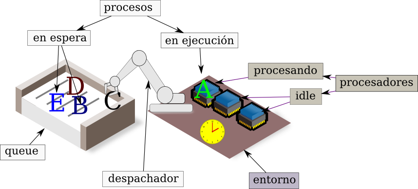

# fakeSched

Este proyecto consiste de una biblioteca para la creación de
simulaciones que ejemplifiquen algunos conceptos de administración de
procesos en un sistema operativo. Se desarrolla como parte del curso
"Sistemas Operativos" impartido por el Dr. Yoel Ledo en el programa de
[Maestría en Ciencias de la Computación de la Fundación Arturo
Rosenblueth](http://www.rosenblueth.mx/sitio/index.php?option=com_content&task=category&sectionid=6&id=26&Itemid=56)


## Introducción

La biblioteca fakeSched permite la creación de simulaciones de filas
de ejecución de procesos que han de ejecutarse en entornos que pueden
tener uno o más procesadores.

Consiste de tres clases:
 * Entorno
 * Procesador
 * Proceso

Considerese el siguiente dibujito:



El queue no es una clase pues se trata de una mera lista que contiene
procesos.

Un objeto Entorno tiene un método despachador que toma procesos del
queue y se los da a sus Procesadores (puede tener uno o más).

Con el paso de cada unidad de tiempo los procesadores van cambiando de
estado y van alterando el estado de los Procesos que les despachan.


# Procesador

Se crean objetos tipo procesador a partir de la clase, así:

```python
cpu = Procesador(tiempo_cambio = 20, 
                 quantum       = 4000)

```

## Estados de un Procesador

### TCT: Tiempo de Cambio de Contexto

Al cambiar de un proceso a otro, ya sea por finalización o por
agotamiento de quantum, los Procesadores adoptan el estado de TCT por
el tiempo definido al construir el objeto.


### idle

Un procesador que no está ejecutando un proceso y no está cambiando de
contexto está "idle".

### Running o 'R'

Cuando un procesador tiene asignado un proceso, está en estado 'R'.


# Proceso

Los objetos proceso se crean a partir de la clase usando su constructor, asi:

```python

A= Proceso("A",
            duracion = 300, 
            inicio   = 3,   
            bloqueos = 10,
            tiempo_bloqueo=2),

```

Los argumentos son:
 * duracion: tiempo de ejecución que debe acumular el proceso, independientemente del tiempo de la simulación.
 * inicio: en que momento debe empezar a ejecutarse.
 * bloqueos: cuantas veces puede bloquearse, al azar, durante la simulación.
 * tiempo de bloqueo: cuantas unidades de tiempo deben transcurrir mientras el proceso esté en estado "B".


## Estados de un Proceso
### Wait

Cuando un proceso no ha sido asignado a un procesador está en estado
'W'.

### Bloqueado

Cuando un proceso al azar entra en estado de bloqueado
su estado es "B". Permanecerá en este estado hasta que se acumule
tiempo de ejecución en que haya estado en este estado.

### Running

Cuando un proceso es asigando a un procesador está en estado
"R". Durante este estado acumula tiempo de ejecución.


## Simulación de un Proceso y un Procesador

A continuación usamos la biblioteca fakeSched para implementar una
simulación muy simple.

Considere el siguiente código, con especial atención a los comentarios:


```python
# coding: utf-8

# Esta simulación muestra el uso de un entorno con un sólo CPU y un
# sólo proceso.


from fake_scheduler import *
from time import sleep

# Entorno
e = Entorno()

# el entorno tiene 1 sólo procesador
e.procesadores = [ Procesador(tiempo_cambio = 2,
                              quantum       = 4), ]


# en el queue hay un sólo proceso
queue = [
    # el proceso con el PID=A
    Proceso("A",
            duracion=7, # debe durar 7 unidades 
            inicio=3,   # pero no puede empezar antes de que t=3
            bloqueos=1, # puede bloquearse, al azar, una vez
            tiempo_bloqueo=2), # si se bloquea, será por dos unidades
                               # de tiempo
    ]

# mientras haya procesos en el queue
while queue:    
    # dar cada proceso al despachador, ya se verá si corre
    for p in queue:
        e.despacha(p)
        
    # imprime qué procesador esta ejecutando qué proceso
    print(e)

    # el tiempo pasa, actualiza estado de procesadores y procesos
    e.ejecuta()
    
    # quita procesos terminados del queue
    for p in queue:
        if p.status == 'F':
            del(queue[queue.index(p)])


```

Tras ejecutar la simulación con este comando:

```
$ python simulacion_1proceso_1cpu.py
```

Se despliega la siguiente tabla.

```
0 [<cpu idle>]
1 [<cpu idle>]
2 [<cpu idle>]
3 [<cpu R (pid=A st=R d=7 t=0 d-t=7)>]
4 [<cpu R (pid=A st=R d=7 t=1 d-t=6)>]
5 [<cpu R (pid=A st=B d=7 t=2 d-t=5)>]
6 [<cpu R (pid=A st=B d=7 t=2 d-t=5)>]
7 [<cpu TCT>]
8 [<cpu TCT>]
9 [<cpu R (pid=A st=R d=7 t=2 d-t=5)>]
10 [<cpu R (pid=A st=R d=7 t=3 d-t=4)>]
11 [<cpu R (pid=A st=R d=7 t=4 d-t=3)>]
12 [<cpu R (pid=A st=R d=7 t=5 d-t=2)>]
13 [<cpu TCT>]
14 [<cpu TCT>]
15 [<cpu R (pid=A st=R d=7 t=6 d-t=1)>]
```

El proceso "A" empieza hasta t=3, cuando su status cambia a R. Antes
de esto el Procesador está en estado "idle".

En t=5 el proceso "A" se bloquea por dos unidades de tiempo, hasta
t=6.

En t=7 el procesador echa al proceso A cuando se acaba el quantum de 4
unidades, cambia a estado TCT por 2 unidades y mientras no admite
nuevos procesos.

Luego en t=9 le despachan otra vez el proceso "A" y corre sin
interrupción hasta que se le acaba otra vez el quantum en t=13.

Después de otras dos unidades de estado TCT, termina finalmente la
simulación en el t=15.


# Una simulación más complicada


La siguiente simulación es más complicada por varias razones: son más
procesos y más procesadores, pero además procesos y procesadores
tienen parámetros diferentes.

Obsérvese cómo un procesador tiene un quantum mucho más largo que
cualquier proceso, esto tendrá el efecto de que no interrumpirá a
ninguno.

También se especifican un par de procesos que no se bloquearán.


```python
# coding: utf-8

from fake_scheduler import *
from time import sleep


e = Entorno()


# el entorno tiene 2 procesadores con diferentes quanta
e.procesadores = [ Procesador(tiempo_cambio = 2,
                              quantum       = 3000),
                   Procesador(tiempo_cambio = 2,
                              quantum       = 5),
               ]


queue = [
    Proceso("A", duracion=20,
            inicio=3,  
            bloqueos=2, tiempo_bloqueo=1),
    Proceso("B", duracion=10,
            inicio=0,  
            bloqueos=0),
    Proceso("C", duracion=15,
            inicio=0,  
            bloqueos=1, tiempo_bloqueo=2),
    Proceso("D", duracion=4,
            inicio=5,  
            bloqueos=0)

]


while queue:    

    for p in queue:
        e.despacha(p)
        

    print(e)

    e.ejecuta()

    
    # quita procesos terminados del queue
    for p in queue:
        if p.status == 'F':
            del(queue[queue.index(p)])
```

La simulación corre con este comando:

    $ python simulacion_4proceso_2cpus.py


Genera una tabla parecida a la siguiente:

    0 [<cpu R (pid=B st=R d=10 t=0 d-t=10)>, <cpu R (pid=C st=R d=15 t=0 d-t=15)>]
    1 [<cpu R (pid=B st=R d=10 t=1 d-t=9)>, <cpu R (pid=C st=B d=15 t=1 d-t=14)>]
    2 [<cpu R (pid=B st=R d=10 t=2 d-t=8)>, <cpu R (pid=C st=B d=15 t=1 d-t=14)>]
    3 [<cpu R (pid=B st=R d=10 t=3 d-t=7)>, <cpu R (pid=C st=R d=15 t=1 d-t=14)>]
    4 [<cpu R (pid=B st=R d=10 t=4 d-t=6)>, <cpu R (pid=C st=R d=15 t=2 d-t=13)>]
    5 [<cpu R (pid=B st=R d=10 t=5 d-t=5)>, <cpu TCT>]
    6 [<cpu R (pid=B st=R d=10 t=6 d-t=4)>, <cpu TCT>]
    7 [<cpu R (pid=B st=R d=10 t=7 d-t=3)>, <cpu R (pid=A st=R d=20 t=0 d-t=20)>]
    8 [<cpu R (pid=B st=R d=10 t=8 d-t=2)>, <cpu R (pid=A st=R d=20 t=1 d-t=19)>]
    9 [<cpu R (pid=B st=R d=10 t=9 d-t=1)>, <cpu R (pid=A st=R d=20 t=2 d-t=18)>]
    10 [<cpu TCT>, <cpu R (pid=A st=R d=20 t=3 d-t=17)>]
    11 [<cpu TCT>, <cpu R (pid=A st=B d=20 t=4 d-t=16)>]
    12 [<cpu R (pid=A st=R d=20 t=4 d-t=16)>, <cpu TCT>]
    13 [<cpu R (pid=A st=R d=20 t=5 d-t=15)>, <cpu TCT>]
    14 [<cpu R (pid=A st=B d=20 t=6 d-t=14)>, <cpu R (pid=C st=R d=15 t=3 d-t=12)>]
    15 [<cpu R (pid=A st=R d=20 t=6 d-t=14)>, <cpu R (pid=C st=R d=15 t=4 d-t=11)>]
    16 [<cpu R (pid=A st=R d=20 t=7 d-t=13)>, <cpu R (pid=C st=R d=15 t=5 d-t=10)>]
    17 [<cpu R (pid=A st=R d=20 t=8 d-t=12)>, <cpu R (pid=C st=R d=15 t=6 d-t=9)>]
    18 [<cpu R (pid=A st=R d=20 t=9 d-t=11)>, <cpu R (pid=C st=R d=15 t=7 d-t=8)>]
    19 [<cpu R (pid=A st=R d=20 t=10 d-t=10)>, <cpu TCT>]
    20 [<cpu R (pid=A st=R d=20 t=11 d-t=9)>, <cpu TCT>]
    21 [<cpu R (pid=A st=R d=20 t=12 d-t=8)>, <cpu R (pid=C st=R d=15 t=8 d-t=7)>]
    22 [<cpu R (pid=A st=R d=20 t=13 d-t=7)>, <cpu R (pid=C st=R d=15 t=9 d-t=6)>]
    23 [<cpu R (pid=A st=R d=20 t=14 d-t=6)>, <cpu R (pid=C st=R d=15 t=10 d-t=5)>]
    24 [<cpu R (pid=A st=R d=20 t=15 d-t=5)>, <cpu R (pid=C st=R d=15 t=11 d-t=4)>]
    25 [<cpu R (pid=A st=R d=20 t=16 d-t=4)>, <cpu R (pid=C st=R d=15 t=12 d-t=3)>]
    26 [<cpu R (pid=A st=R d=20 t=17 d-t=3)>, <cpu TCT>]
    27 [<cpu R (pid=A st=R d=20 t=18 d-t=2)>, <cpu TCT>]
    28 [<cpu R (pid=A st=R d=20 t=19 d-t=1)>, <cpu R (pid=C st=R d=15 t=13 d-t=2)>]
    29 [<cpu TCT>, <cpu R (pid=C st=R d=15 t=14 d-t=1)>]
    30 [<cpu TCT>, <cpu TCT>]
    31 [<cpu R (pid=D st=R d=4 t=0 d-t=4)>, <cpu TCT>]
    32 [<cpu R (pid=D st=R d=4 t=1 d-t=3)>, <cpu idle>]
    33 [<cpu R (pid=D st=R d=4 t=2 d-t=2)>, <cpu idle>]
    34 [<cpu R (pid=D st=R d=4 t=3 d-t=1)>, <cpu idle>]


Los primeros procesos en ejecutarse son B y C pues A y D tienen
tiempos de inicio posteriores.

El segundo procesador tiene un quantum de 5 unidades de tiempo, por lo
que con ese periodo cambia de proceso y entra en estado TCT.

El proceso A se bloquea cuatro veces durante una sóla unidad de
tiempo.